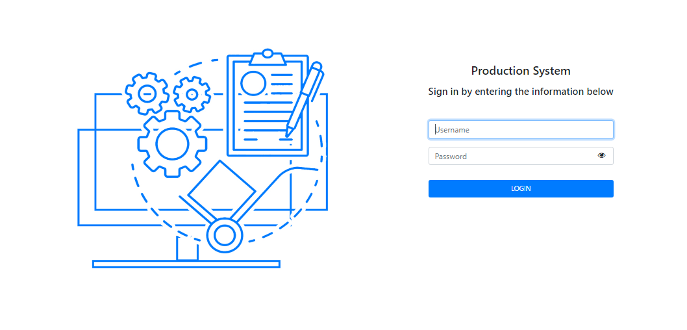
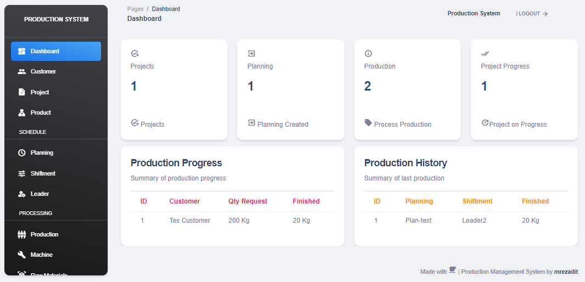
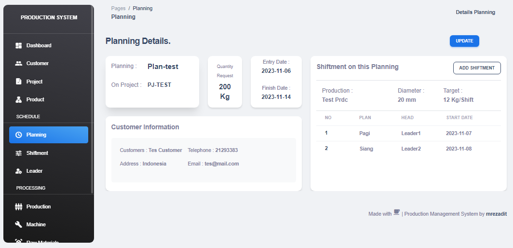
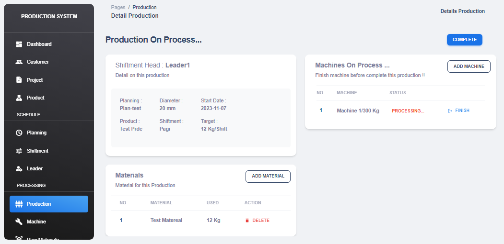
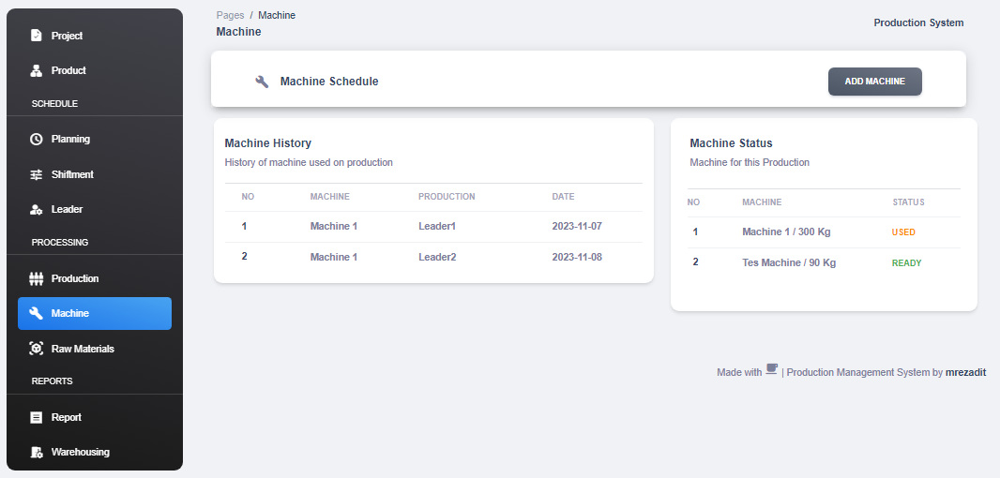
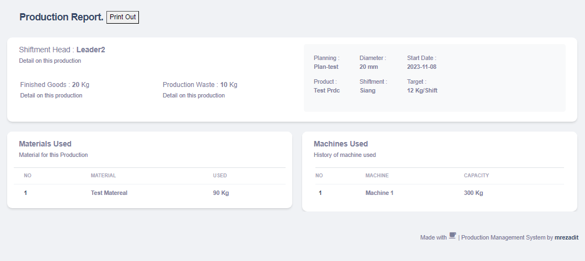

# Production-Management-System
**Source code for production management systems with CodeIgniter, PHP & MySql.**
The case of this system is for **factory production**, system focuses on production planning, production processes, machines and materials used and production reports.

# Features
- **Dashboard** - Summary of production progress & history  
- **Customer** - Customer data, add & update  
- **Project** - Customer requests for product quantity to be produced 
- **Planning** - Production plan from customer request projects, include shiftment, production date and target 
- **Shiftment**- Shiftment that works on the production process, include the Leader (Staff Head) with production date and target 
- **Leader** -  Leader data (Staff Head) add & update 
- **Production** - The production process for each Shiftment, include production planning, the machines and materials used in the production process 
- **Machine** - Machine data, status, and history of machine used 
- **Material** - Material data, stock, and history of material used 
- **Report** - Production report, contains sorting of production result (finished goods & waste) 
- **Warehouse** - Production progress from quantity request with total finished goods from completed production 

# Requirement
- **XAMPP**
- **PHP** (version 8.0.25, not tested with other version yet)

# How to install
- Copy and extract this folder to ``xampp/htdocs``
- Create database with the name ``db_production`` in phpmyadmin
- Import database file from ``/db/db_production.sql``
- Run this system in a browser, then input login information from ``READMEEE!!.txt``

# Screenshot
- **Login**
<picture>
    
</picture>

- **Dashboard**
<picture>
    
</picture>

- **Planning**
<picture>
    
</picture>

- **Production**
<picture>
    
</picture>

- **Machine**
<picture>
    
</picture>

- **Reports**
<picture>
    
</picture>
